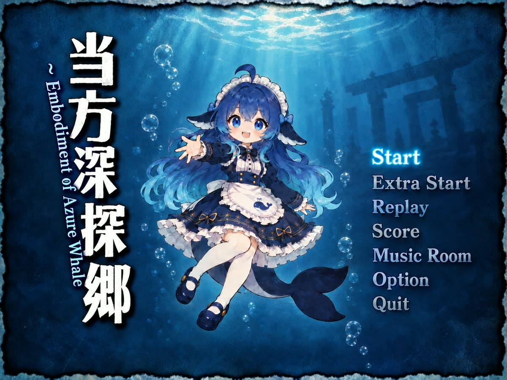

# touhou-shintankyo



Reverse-engineering toolkit for `th06c.exe`, the EoSD-engine game installed at
`steamapps\common\th06c\` (title screen: 当方深探郷 ~ Embodiment of Azure Whale).

The toolkit reads game state out of a running process, writes the counters back,
and disassembles the executable on disk. Every address in this repository was
derived by static analysis of the executable and then confirmed against the live
process.

**Windows only.** The toolkit uses `ctypes` bindings to `user32`, `gdi32`, and
`kernel32` for window capture and process memory access.

## What it is for

Two goals, in order of how well they are finished:

1. **Read the game's own state instead of guessing from pixels.** Positions,
   hitboxes, and collision flags come from the entity arrays, so no thresholds
   or per-stage tuning are involved.
2. **Modify the counters.** Lives, bombs, score, and power are plain fields in
   `.data` and are writable at runtime; the HUD updates immediately.

The write-up in [`th06c-tools/WORKLOG.md`](th06c-tools/WORKLOG.md) records how
each address was found, including the false starts, the mistakes, and what was
never verified. This README summarises the results.

## Requirements

- Windows
- Python 3.14 (3.9 or later should work; only 3.14 was tested)
- `capstone>=5.0`, for the static-analysis tools only
- Your own copy of the game, for anything that reads a running process or the
  executable

```
pip install -r requirements.txt
```

No game files are distributed with this repository. See
[Legal](#legal).

## Addresses

Addresses are **RVAs**: offsets from the module base. They are stable across
launches. The module base is not, because of ASLR, so resolve it at runtime with
`modbase.find_module(pid, "th06c")` and add the RVA.

The executable's own image base is `0x140000000`. One observed runtime base was
`0x7ff711bd0000`.

### Counters and configuration

| Field | RVA | Type | Notes |
|---|---|---|---|
| `lives` | `0x3EE804` | signed byte | one HUD star per unit |
| `bombs` | `0x3EE805` | signed byte | one HUD star per unit |
| `score` | `0x3ED7BC` | dword | displayed 得点; the HUD reads this |
| `score_accumulator` | `0x3ED7C0` | dword | receives score additions |
| `high_score` | `0x3ED7C8` | dword | displayed 最高得点 |
| `power` | `0x3ED034` | word | HUD power bar, 0..128 |
| `cfg_lives` | `0xBC28EC` | byte | death path and stage init read this |
| `cfg_bombs` | `0xBC28ED` | byte | **a death refills bombs from this** |
| `start_lives` | `0xBC28C4` | byte | read by the continue path |
| `start_bombs` | `0xBC28C5` | byte | read by the continue path |

Keep `lives` and `bombs` in `0..8`. The HUD loops once per unit and draws one
sprite each time, so a larger value drives the draw loop wild. 8 is also the
game's own cap for bombs, enforced by `cmp byte ptr [0x3EE805], 8` / `jge` at
RVA `0x2B609`.

A death decrements `lives` and refills `bombs` from `cfg_bombs`, so changing the
live counters alone does not survive one death. Set all six fields to make a
change stick. `gamestate.py` clamps lives and bombs to `0..8`.

### Everything that can kill the player

There are two fatal sources, and they are separate code paths.

| Object | RVA | Array | Stride | Slots |
|---|---|---|---|---|
| `g_BulletManager` | `0x955410` | `+0x008` | `0x5D0` | 640 |
| `g_EnemyManager` | `0xA7E1E0` | `+0x008` | `0xFD0` | 257 |
| `g_Player` | `0xBB89F0` | — | — | — |

`g_BulletManager` also holds `bulletCount` at `+0xE8808`; `g_EnemyManager` holds
`enemyCount` at `+0x000`.

| Field | Offset | Notes |
|---|---|---|
| `Bullet.pos` | `+0x030` | three floats |
| `Bullet.state` | `+0x044` | 0 inactive, 1 fired, 2..4 spawning, 5 despawning |
| `Bullet.isGrazed` | `+0x5C8` | |
| `Enemy.position` | `+0x0A8` | three floats |
| `Enemy.flags1` | `+0x0B4` | bit 7 is `isSlotOccupied` |
| `Enemy.flags2` | `+0x0B5` | b0 `isInteractable`, b1 `isCollidable`, b2 `hasBeenInBounds`, b3 `isBoss`, b4 `isDamageable` |
| `Enemy.flags3` | `+0x0B6` | b3 `isInvisible` |
| `Enemy.life` | `+0x21C` | |
| `Enemy.hitbox` | `+0x2A4` | raw; the touch test uses this divided by 1.5 |
| `Player.hitboxTopLeft` | `+0x410` | the 2.5x2.5 hitbox, not the sprite |
| `Player.hitboxBottomRight` | `+0x41C` | |
| `Player.playerState` | `+0x73B8` | 0 alive, 1 spawning, 2 dead, 3 invulnerable |

The relevant functions, all in `.text`:

| Function | RVA |
|---|---|
| `BulletManager_OnUpdate` | `0x0DB90` |
| `Player::CheckGraze` | `0x4C3E0` |
| `Player::CalcKillBoxCollision` | `0x4C690` |
| enemy collision loop | `0x20780` |

`Player::CalcKillBoxCollision` is what calls `Player::Die()`. Only bullets reach
`CheckGraze`, so **bullets are the only thing that grazes; touching an enemy
gives no graze credit.**

An enemy kills on contact exactly when

```
isSlotOccupied && isInteractable && isCollidable && hasBeenInBounds
    && !isBoss && !isInvisible
```

so bosses are drawn distinctly: they shoot at you but do not kill you by
touching you.

`CalcKillBoxCollision` reports a hit without calling `Die()` whenever
`playerState != ALIVE`. A "can I be hit right now" check that ignores
`playerState` reports deaths that cannot happen.

## Quick start

Both commands need the game running.

```
cd th06c-tools

# Read every counter
python gamestate.py show

# Hold lives and bombs at 8, reapplying every 3 seconds
python -u keepalive.py --interval 3

# Dump bullets, enemies, and the player, and overlay them on a capture
python entities.py
```

`entities.py` writes `entities.png`: three panels showing the raw screen, the
markers drawn y-down, and the same markers drawn y-up. Green is a bullet, red an
enemy that kills on touch, cyan an enemy that does not, white the player's hitbox
centre. Both y orientations are drawn on purpose, so a regression in the
coordinate convention is visible rather than silent.

If the game is paused or in dialogue there is nothing in flight to align
against, and `entities.py` reports `bulletCount=0`. Use `--catch S` to poll until
bullets appear:

```
python entities.py --catch 5
```

## Tools

`th06c-tools/` holds 35 Python scripts plus a small PowerShell helper. They are
flat modules that import each other by name, so run them from that directory.

### Primitives

| Script | Purpose |
|---|---|
| `th06.py` | Win32 window helper: list, focus, capture, send keys |
| `memedit.py` | Read and write another process's memory |
| `memscan.py` | Read-only process memory inspection |
| `modbase.py` | Live module base and PE section layout |
| `gamepath.py` | Where `th06c.exe` lives on disk; honours `TH06C_DIR` |
| `pngout.py` | Minimal PNG writer, so overlays can be viewed without Pillow |
| `bmp2png.ps1` | PowerShell helper: downscale a BMP to a PNG via `System.Drawing` |

### Reading and writing game state

| Script | Purpose |
|---|---|
| `gamestate.py` | Named read/write access to the counters |
| `keepalive.py` | Reapply lives and bombs whenever the game lowers them |
| `entities.py` | Everything that can kill you, plus the player, overlaid on screen |
| `bullets.py` | Bullets only; superseded by `entities.py` |
| `hud.py` | Count HUD star icons by colour, to read lives and bombs from pixels |
| `hudwatch.py` | Pin a HUD counter to its memory address by watching it change |
| `tasklist.py` | Walk the static task list and identify each node's owner object |

### Static analysis (no running game needed)

| Script | Purpose |
|---|---|
| `disasm.py` | PE reader plus capstone disassembler; ranges, `--refs`, `--secs` |
| `findrefs.py` | x64 RIP-relative references to an address in `.text` |
| `arrayrefs.py` | Code that indexes an inline array inside a game object |
| `offsets.py` | Histogram the field offsets a function references |
| `codeindex.py` | Index `.text` once, then answer cross-reference queries fast |

`codeindex.py --build` walks the 4,514 function ranges in `.pdata` so that every
function is disassembled from its true entry point, rather than linear-sweeping
`.text` and going wrong at the first data byte.

### Discovery

These found the addresses above. They are kept because the same techniques apply
to any other value in this engine, not because they are needed to use the
results.

| Script | Purpose |
|---|---|
| `findobj.py` | Candidate game-state objects in `.data`, by field signature |
| `findplayer.py` | The live player struct, by read-only memory differencing |
| `framediff.py` | Whole-memory frame differ, filtered to moving coordinates |
| `hunt.py` | Entity pools, by diffing a live game |
| `poolscan.py` | Frame-diff, then infer each cluster's record layout |
| `pairscan.py` | Pools of `(x, y)` coordinate pairs, and their stride |
| `livescan.py` | Wait until the game is genuinely running, then scan immediately |
| `liverun.py` | Snapshot a live game and pull bullet vertices out of memory |
| `freezeread.py` | Freeze the game, read a pool, then find where those positions live |
| `bombcand.py` | Test whether candidate addresses hold the bomb counter |
| `playermove.py` | Locate the player's position by driving the game and diffing |
| `playerdiff.py` | Isolate the player's coordinate with an out-and-back differential |
| `pixdiff.py` | Whether the game is actually moving on screen, and where |
| `screenmap.py` | Split the playfield into bright sprites and large light beams |
| `blobs.py` | Find bright sprites in the playfield and draw them |
| `simplify.py` | Capture the window as a downscaled image or ASCII |
| `peek.py` | Capture the window to a small BMP for direct inspection |

### Not tracked

`th06c-tools/scratch/` holds one-off probes that reached a dead end and are not
part of the toolkit. It is excluded by `.gitignore` and absent from a fresh
clone.

## Caveats

**The window geometry is resolution-dependent.** Coordinates are game units with
the origin at the top of the playfield and y increasing downward. The playfield
is 384x448 units and occupies the window rect `(856,48)-(2008,1392)`, which is
1152x1344 px, so 3 px per unit. `hud.py` and the overlay in `entities.py` assume
that geometry; adjust `PLAYFIELD` and `PX_PER_UNIT` for a different resolution.

**A paused game freezes the capture with it.** This game pauses when it loses
focus and stays paused until the pause menu entry is confirmed; refocusing alone
does not resume it. A capture of a paused game shows the pause overlay, and every
frame diff against it measures the menu rather than gameplay.

**Capture rows are BGR, not RGB.** `th06.capture` returns 24-bit rows in BGR
order, so a colour literal written as `#RRGGBB` renders with red and blue
swapped. `entities.py` labels its constants to make this explicit.

**A read-only process handle makes every write fail silently.** Open the process
with `PROCESS_VM_WRITE` as well as `PROCESS_VM_READ`, or writes appear to succeed
and change nothing.

**A `.pdata` range is not always a function entry**, and `disasm.py --ctx` picks
an alignment by decodability, which is occasionally wrong.

**`hud.py` counts icons by colour** in the fixed region
`(2205, 350, 700, 145)`, and needs that region adjusted for a different
resolution.

## Legal

This repository contains no game code, no game data, and no screenshots of the
game. It contains addresses, disassembly notes, and tooling.

Using it requires your own legitimate copy of the game. Whether modifying a
running game process is permitted is governed by that game's licence, not by
this repository's licence. The MIT licence below covers only the original code
and documentation here.

## Licence

MIT. See [LICENSE](LICENSE).
